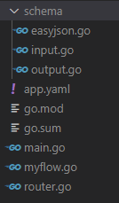

[](https://pkg.go.dev/github.com/borgmon/tunaflow?tab=doc)

# Tunaflow
Tunaflow is a backend-as-config tool. It can generate a data transformation micro-service ready to deploy, all with YAML. With power of TunaSchool(WIP), easyjson and gin, your data flow can scale infinity and light-weight. 

## Overview
How many hours do you spend on simple data transformation tasks/data mapping services? Say hi to Tunaflow.

With Tunaflow you can write a yaml and generate a deploy-ready package instantly. 

All you need to do is define `schema`, and use `flow` to link everything together.

With TunaSchool you can balance flows across different packages.

## Installation
```bash
go get -u github.com/borgmon/tunaflow
```

## Usage
After create a new empty folder, run
```bash 
tunaflow init {package path}
```
This will generate an example config file for you to start with.

After writing your YAML config, run
```bash
tunaflow apply
```
to generate your project.


## Road Map
- [ ] json example file as input
- [ ] subflow to handle one to many mappings
- [ ] openapi doc generation
- [ ] finish up go doc
- [ ] validation for config
- [ ] more CLI options(clean, build)
- [ ] exclusive files
- [ ] tests
- [ ] refactor using interfaces to allow extension
- [ ] pass file path in yaml
- [ ] TunaSchool
- [ ] allow custom middleware 
- [ ] async handler option
- [ ] fuzzy match or use ML
